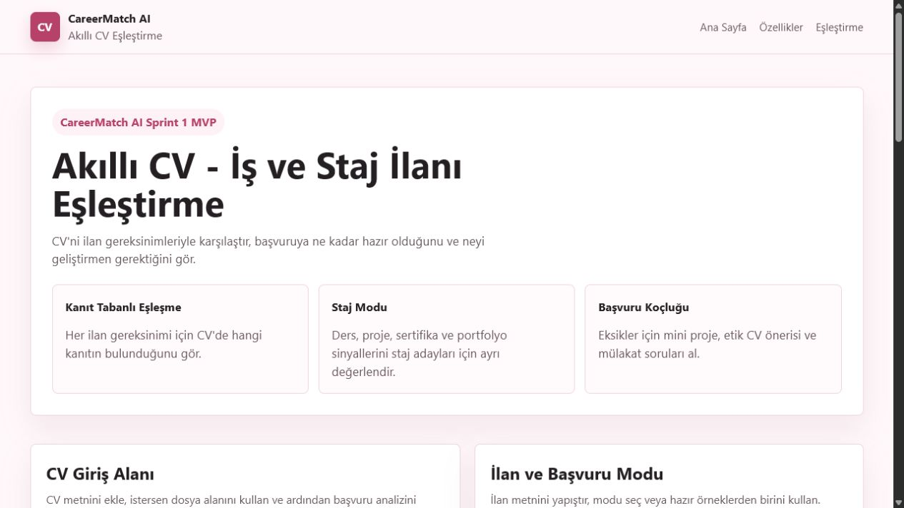

# Akıllı CV – İş İlanı Eşleştirme / CareerMatch AI

## Takım İsmi

Takım 5

## Takım Rolleri

- Product Owner: Yusuf Şengöz
- Scrum Master: Zeynep Özkan
- Developer: Ceren Aydın
- Developer: Feyza Korkmaz

## Ürün İsmi

Akıllı CV – İş İlanı Eşleştirme

Sprint 1 konumlandırma adı: CareerMatch AI

## Ürün Açıklaması

Akıllı CV, kullanıcıların yüklediği CV belgelerini yapay zeka ile analiz eden ve iş ilanlarıyla uygunluk oranını hesaplayan akıllı bir kariyer destek platformudur.

CareerMatch AI yaklaşımıyla ürün yalnızca bir CV-ilan skor aracı değildir. Adayın CV'sindeki kanıtları ilan gereksinimleriyle eşleştirir, eksik becerileri gösterir, başvuruya hazırlık skoru üretir ve başvuru öncesi etik gelişim önerileri sunar.

## Ürün Özellikleri

- PDF/DOCX formatındaki CV'yi analiz etme
- Yetenekleri otomatik çıkarma
- İş ilanındaki gereksinimleri analiz etme
- CV ve ilan arasında benzerlik skoru oluşturma
- Eksik yetenekler için öneriler sunma
- Kullanıcıya geliştirme tavsiyeleri verme
- Kanıt tabanlı eşleşme tablosu
- İş başvurusu ve staj başvurusu modu
- Başvuruya hazırlık skoru
- Mini portfolyo proje önerisi
- Etik CV iyileştirme önerileri
- İlan odaklı mülakat soruları

## Hedef Kitle

- İş arayan adaylar
- Yeni mezunlar
- Kariyer değişikliği yapmak isteyen kişiler
- İnsan kaynakları uzmanları

## Teknolojiler

- Python
- FastAPI
- React
- Vite
- NLP için Sprint 1'de kural tabanlı anahtar kelime çıkarımı
- Gelecek sprintler için LLM API, Sentence Transformers ve PostgreSQL

## Sprint 1 MVP

Sprint 1 hedefi; çalışan bir MVP, özgün ürün özellikleri ve GitHub üzerinde izlenebilir dokümantasyon oluşturmaktır.

## Ürün Görseli



## Sprint 1 Teslim Düzeni

Bootcamp kılavuzunda her sprint sonunda beklenen proje yönetimi çıktıları Sprint 1 için 6 başlık altında düzenlendi:

1. Backlog dağıtma mantığı
2. Daily Scrum notları
3. Sprint Board Updates
4. Ürün durumu
5. Sprint Review
6. Sprint Retrospective

Tek sayfa Sprint 1 teslim özeti: [sprint-1/README.md](sprint-1/README.md)

MVP akışı:

1. Kullanıcı CV metni girer veya PDF/DOCX dosyasından metin çıkarır.
2. Kullanıcı iş/staj ilanı metni girer veya hazır örnek ilan seçer.
3. Kullanıcı İş Başvurusu veya Staj Başvurusu modunu seçer.
4. Backend CV becerilerini ve ilan gereksinimlerini çıkarır.
5. Sistem eşleşme skoru, başvuruya hazırlık skoru, kanıt tablosu, eksik beceriler, mini proje önerisi, etik CV önerileri ve mülakat soruları üretir.
6. Frontend sonuçları tek ekranda gösterir.

## Yerel Kurulum

### Backend

```bash
cd backend
pip install -r requirements.txt
uvicorn app:app --reload
```

Backend varsayılan adres: `http://127.0.0.1:8000`

### Frontend

```bash
npm install
npm run dev
```

Frontend varsayılan adres: `http://localhost:5173`

## API

```http
POST /analyze
```

Örnek istek:

```json
{
  "cv_text": "Python ile veri analizi projesi geliştirdim.",
  "posting_text": "Python, SQL ve Machine Learning bilen stajyer aranıyor.",
  "application_type": "internship"
}
```

## Dokümantasyon

- [Ürün vizyonu](docs/product_vision.md)
- [Takım rolleri](docs/team_roles.md)
- [Kullanıcı personaları](docs/user_personas.md)
- [Ürün backlog](docs/product_backlog.md)
- [Özgünlük noktaları](docs/originality_points.md)
- [AI mimarisi](docs/ai_architecture.md)
- [Sprint 1 teslim özeti](sprint-1/README.md)
- [Sprint 1 planı](sprint-1/sprint_planning.md)
- [Sprint 1 ürün durumu](sprint-1/product_status.md)
