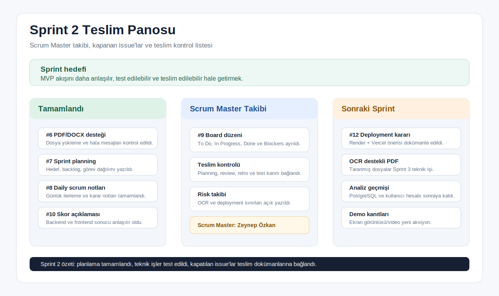

# Sprint 2 Teslim Özeti

Bu klasör, Sprint 2 sonunda beklenen proje yönetimi ve ürün kanıtlarını tek yerden takip etmek için hazırlanmıştır.

## Sprint 2 Hedefi

Sprint 2'de temel hedef, Sprint 1'de ortaya çıkan çalışan MVP'yi daha anlaşılır, test edilebilir ve teslim edilebilir hale getirmekti. Bu nedenle dosya yükleme, skor açıklaması, test, deployment araştırması ve sprint dokümantasyonu birlikte ele alındı.

## Sprint 2 Görsel Kanıtı

Bu görsel, Sprint 2 sonunda tamamlanan işleri, Scrum Master takibini ve sonraki sprint için açık kalan teknik başlıkları tek ekranda göstermek için eklendi.

## Teslim Dokümanları

1. [Sprint planning](sprint_planning.md)
2. [Backlog dağılımı](backlog_distribution.md)
3. [Daily scrum notları](daily_scrum_notes.md)
4. [Sprint board updates](sprint_board_updates.md)
5. [Ürün durumu](product_status.md)
6. [Sprint review](sprint_review.md)
7. [Sprint retrospective](sprint_retrospective.md)

## Scrum Master Notu

Bu sprintte Scrum Master sorumluluğu sadece doküman yazmakla sınırlı tutulmadı. Sprint hedefi, backlog önceliği, issue takibi, blocker notları, test kanıtı ve teslim kontrol listesi aynı klasör altında birleştirildi. Böylece jüri ya da takım üyesi repoya baktığında Sprint 2'de neyin planlandığını, neyin tamamlandığını ve neyin sonraki sprinte kaldığını tek akışta görebilir.

## Sprint 2'de Tamamlanan Ana İşler

- Sprint 2 planlama dokümanı hazırlandı.
- PDF/DOCX CV yükleme akışı ürün içinde görünür ve kullanılabilir hale getirildi.
- Backend analiz cevabına skor açıklaması eklendi.
- Frontend sonuç ekranında skor açıklaması gösterildi.
- Backend için skor açıklamasını kontrol eden testler eklendi.
- Deployment seçenekleri araştırıldı ve önerilen yol dokümante edildi.
- Sprint 2 board, daily scrum, review ve retrospective kayıtları tamamlandı.

## Kapatılan Issue Vurgusu

- #6 PDF/DOCX CV yükleme desteğini güçlendir
- #7 Sprint 2 planning dokümanını oluştur
- #8 Sprint 2 daily scrum notları şablonunu hazırla
- #9 Sprint 2 GitHub board düzenini oluştur
- #10 Backend analiz sonucuna skor açıklaması ekle
- #12 Deployment seçeneklerini araştır

## Ürün Durumu

Sprint 2 sonunda kullanıcı CV metni girebilir veya uygun PDF/DOCX dosyasından metin çıkartabilir, iş/staj ilanı ile eşleştirme yapabilir ve sonuç ekranında skor, skor açıklaması, eksik beceriler, kanıt tablosu, mini proje önerisi, etik CV önerileri ve mülakat sorularını görebilir.

## Kontrol Listesi

- Sprint 2 planning dosyası var mı: Evet
- Backlog maddeleri listelendi mi: Evet
- Takım görev dağılımı net mi: Evet
- Sprint 1'den taşınan işler belirtildi mi: Evet
- Sprint 2 review ve retrospective yazıldı mı: Evet
- Test ve build kontrolü yapıldı mı: Evet
